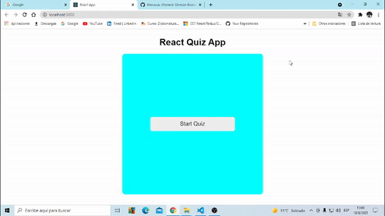

### React Quiz App

Es un juego de preguntas con opciones,que muestra el resultado luego de las tres preguntas.

Tres componentes iniciales
<ul>
  <li>Menu</li> 
  <li>Quiz</li>
  <li>Endscreen</li>
</ul>
  

-------

  Use el hook <strong>useState</strong> para darle un estado a cada componente inicial.A travez de un condicional ,el estado de la variable gameState  determina que componente se renderiza.
  
Luego con el hook <strong>useContext</strong> cree un estado global y lo empleé en todos los componentes iniciales y le dí los valores de gameState y la funcion que la modifica setGameState.Así pude utilizar éstos valores en los diferentes componentes.En el menu ,coloqué un botón con el evento <strong>onClick</strong> y dentro de éste la funcion setGameState que cambia el estado cuando se clickea y lo cambia a quiz.
  
----------

  
 
Las preguntas estan en un areglo y cada pregunta es un objeto diferente y  cuenta con la funcion <strong>prompt</strong>.El Quiz tiene un estado inicial de 0 que es la primera pregunta.Para diferenciar las opciones clickeadas a travez de un nuevo estado ,puse cuatro botones (uno por cada opción) y cada uno con un evento onClick ,que contenga la funcion que cambie el estado de la variable y éste contenga la letra que identifique cada opción

 
Para el resultado ,en un nuevo estado,agregué la variable y la funcion a los valores del useContext y para  calcularlo usé una condición en donde ,sí la respuesta de la pregunta es igual a la opción elegida ,el score aumenta en uno.Para pasar a la siguiente pregunta,puse un botón con el evento onClick que con una funcion se mueve por el arreglo .
  
En la pantalla final aparecen el resultado del quiz ,que lo muestro en un subtitulo en donde por un lado  / esta el score y el otro las preguntas,para saber el número de preguntas utilizé el metodo length.

  
Por último para reiniciar el juego ,usé una nueva variable que lleve el estado de setgameState  y setGameScore a su estado inicial(menu y 0 respectivamente) 

 
-----------

